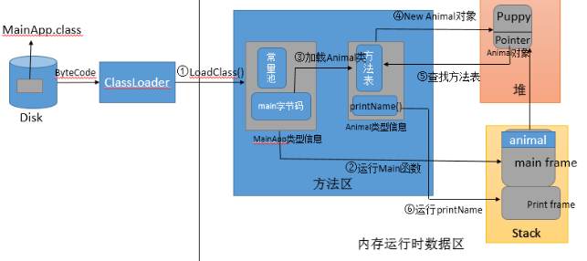
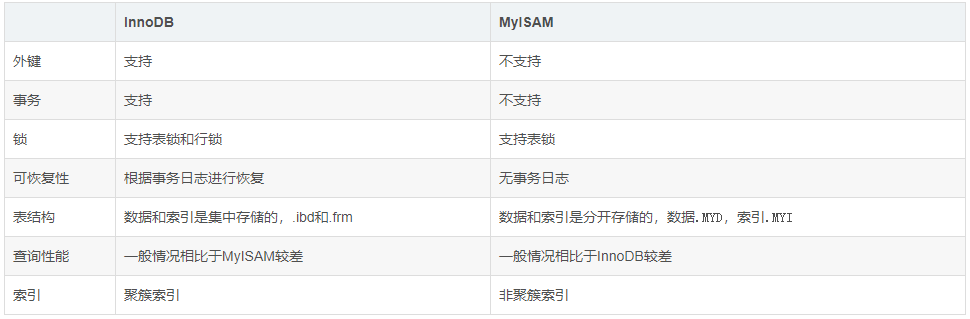
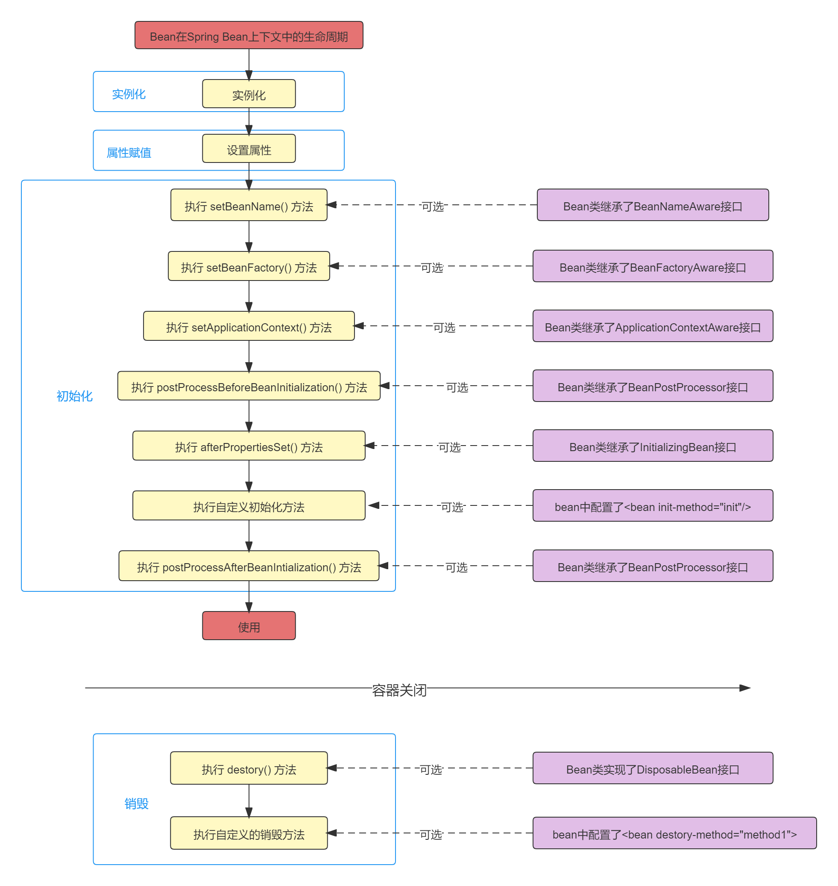

## Java基础

**HashMap 与 HashTable 的区别？**
 1. HashMap 线程不安全；HashTable 线程是安全的，采用synchronized；
 2. HashMap 允许存放key为null；HashTable 不允许存放key为null；
 3. 在多线程的情况下，推荐使用ConcurrentHashMap线程安全，且效率非常高；

**重写了 equals 方法 为什么 也需要重写 HashCode 方法？**
+ == 与 equals 区别
    + == 比较两个对象内存地址，equals方法属于Object父类中，默认的情况下两个对象内存地址是否相等，
      只是我们重写 Object 父类中equals方法来实现比较对象属性值是否相等
+ 两个对象值如果相等的话，hashCode相等
+ 两个对象值如果不相等的话，hashCode不一定不相等，也可能相等；
+ 两个对象hashCode值 如果相等，值不一定相等
+ 两个对象值如果是相等的话，hashcode是相等。

**什么是 Hash 冲突**
+ Key值不同但是hashcode值相等

**HashMap 的 Hash 冲突如何解决的**
+ Jdk1.7 数组+链表 链表缺陷：如果链表过长的情况下，查询的时间复杂度就是为 o(n) 需要从头查询尾部，效率非常低
+ JDK1.8 数组+链表+红黑树

**HashMap 底层是如何实现的**
+ 在 HashMap1.7 版本中底层是基于数组+链表实现的，如果发生 Hash 冲突概率问
  题，会存放到同一个链表中，链表如果过长会从头查询到尾部，效率非常低。
  所以在HashMap1.8 版本 （数组容量>=64&链表长度大于 8）就会将该链表转化红黑树。

**HashMap 根据key查询时间复杂度？**
1. key 没有产生hash冲突 时间复杂度是为o(1)，只需要查询一次；
2. key 产生 hash冲突采用链表存放则为O(N)，从头查询到尾部；
3. key 产生 hash冲突采用红黑树存放则为O（LogN）；

**ConcurrentHashMap 底层是如何实现？**
1. 传统方式 使用HashTable保证线程问题，是采用synchronized锁将整个
HashTable 中的数组锁住，在多个线程中只允许一个线程访问 Put 或者 Get，效率非常低，但是能够保证线程安全问题。
2. 多线程的情况下 JDK 官方推荐使用 ConcurrentHashMap 
3. ConcurrentHashMap 1.7采用分段锁设计，底层实现原理：数组+Segments 分段锁 +HashEntry 链表实现
    + 大致原理就是将一个大的 HashMap 分成 n 多个不同的小的 HashTable，不同的 key 计算 index 如果没有发生冲突
      则存放到不同的小的 HashTable 中，从而可以实现多线程，同时做 put 操作，但是如果多个线程同时 put 操作 key
      发生了 index 冲突落到同一个小的 HashTable 中还是会发生竞争锁。
4. ConcurrentHashMap 1.7 采用 Lock 锁+CAS 乐观锁+UNSAFE 类，里面有实现类似于 synchronized 锁的升级过程。
5 .ConcurrentHashMap 1.8 版本取消 segment 分段设计，直接使用 Node 数组来保存数据，锁的粒度也从段锁缩小为结点锁；
6. JDK1.8中只需要一次定位，并且采用CAS+synchronized的机制。如果对应下标处没有结点，说明没有发生哈希冲突，
   此时直接通过CAS进行插入，若成功，直接返回。若失败，则使用synchronized进行加锁插入；

**类加载过程**

## Java并发

## MySQL数据库
**MySQL常用的存储引擎有什么？它们有什么区别？**
1. InnoDB：InnoDB是MySQL的默认存储引擎，支持事务、行锁和外键等操作。

2. MyISAM：MyISAM是MySQL5.1版本前的默认存储引擎，MyISAM的并发性比较差，不支持事务和外键等操作，默认的锁的粒度为表级锁。
    

**数据库的三大范式**
1. 第一范式：确保每列保持原子性，数据表中的所有字段值都是不可分解的原子值。
2. 第二范式：确保表中的每列都和主键相关
3. 第三范式：确保每列都和主键列直接相关而不是间接相关

**索引**
   + https://blog.csdn.net/weixin_70730532/article/details/125745202?spm=1001.2100.3001.7377&utm_medium=distribute.pc_feed_blog.none-task-blog-hot_rank_bottoming-9-125745202-null-null.nonecase&depth_1-utm_source=distribute.pc_feed_blog.none-task-blog-hot_rank_bottoming-9-125745202-null-null.nonecase

**索引type级别**
1. 索引type级别说明：system>const>eq_ref>ref>range>index>ALL，type级别，越左边，查询速度越快。
2. SQL 性能优化的目标:至少要达到 range 级别,要求是 ref 级别,如果可以是 consts 最好

**Type级别解释**
1. system级别
 + 只有一条数据的系统表
 + 或衍生表只能有一条数据的主查询
2. const级别
 + 仅仅能查出一条的SQL语句并且用于Primary key 或 unique索引；
 + SELECT * from shop s where s.id=?
 + 主键索引、唯一索引和unique索引达到这个级别，我们写sql要根据公司的业务去写，这个情况也很难达到的。

3. eq_ref级别
 + 唯一性索引：对于每个索引键的查询，返回匹配唯一行数据（有且只有1个，不能多，不能0）;
 + 比如你select …from 一张表 where 比方说有一个字段 name = 一个东西，也就是我们以name作为索引，假设我之前给name加了一个索引值，我现在根据name去查，查完后有20条数据，我就必须保证这二十条数据每行都是唯一的，不能重复不能为空！
只要满足以上条件，你就能达到eq_ref，当然前提是你要给name建索引，如果name连索引都没，那你肯定达不到eq_ref;
此种情况常见于唯一索引和主键索引；
比如我根据name去查，但是一个公司里面或一个学校里面叫name的可能不止一个，一般你想用这个的时候，就要确保你这个字段是唯一的，id就可以，你可以重复两个张三，但是你身份证肯定不会重复；
添加唯一键语法：alter table 表名 add constraint 索引名 unique index(列名)
检查字段是否唯一键：show index form 表名；被展示出来的皆是有唯一约束的；

4. ref级别
+ 非唯一性索引：对于每个索引键的查询，返回匹配的所有行（可以是0，或多个）。
+ 假设有俩张三，我建立了非唯一索引，那么查出来就是这个级别拉，是不是很简单。

5. range级别
+ 检索指定范围的行，查找一个范围内的数据，where后面是一个范围查询 （between,in,> < >=);
+ in有时有可能会失效，导致为ALL；

6. index级别
+ 把索引的数据全查出来 就是这个级别了

7. ALL级别
不做索引 就是all级别咯

## Spring 
### Spring Bean 生命周期

1. 实例化
2. 属性赋值
3. **BeanPostProcessor**的postProcessBeforeInitialization()方法
4. **@PostConstruct**注解方法
5. afterPropertiesSet() 实现**InitializingBean**接口
6. 初始化 init-method 如果这个bean在Spring配置文件中配置了init-method属性，会自动调用其配置的初始化方法
7. **BeanPostProcessor**的postProcessAftrInitialization()方法 
8. @preDestroy
9. DisposableBean接口
10. 销毁 destory-method 如果这个bean在Spring配置文件中配置了destory-method属性，会自动调用其配置的销毁方法。
   
